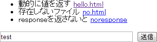

# Gruntの connect を開発用サーバにする

## Gruntのlivereloadを使っているときは便利

サーバからデータを取ってくるクライアントJavaSciriptアプリの開発時に簡単なサーバを用意するときに使います。

既に、Gruntのlivereloadを使っている場合

- 追加のプラグインが不要
- JavaScirptを配置するサーバと同じポートで動くのでSame-Origin Policyの考慮が不要

## grunt-contribe-connect のオプションを活用

grunt-contribe-connect の middleware オプションを使います。
このオプションで任意の処理を返せます。

node.jsのhttpモジュールを使った時と同じように処理を書きます。

## Gruntfile.js サンプル

```
module.exports = function(grunt) {
  grunt.initConfig({
    watch: {}, //connectサーバを待ち受けループにするために必要です。
    connect: {
      server: {
        options: {
          middleware: function(connect) {
            return [function(req, res) {
              res.end("hello world"); //好きなレスポンスを返します。
            }]
          }
        },
      },
    },
  });

  grunt.loadNpmTasks('grunt-contrib-watch');
  grunt.loadNpmTasks('grunt-contrib-connect');
};
```

## 動かしてみます

sample1ディレクトリに一番簡単なGruntfile.jsがあります。

```
cd sample1
```


### Gruntプラグインのインストール

```
npm install grunt-contrib-watch grunt-contrib-connect
```

### 起動
```
grunt connect watch
```

### ブラウザで開く
http://localhost:8000/ を開くと hello world と表示されます。

## 応用編

grunt-contribe-connect は 内部で[Connect](http://www.senchalabs.org/connect/)を利用しています。
ConnectはNode.js上で動きます。Httpサーバ用のミドルウェア群を提供するフレームワークです。

Connectの機能を活用することでより複雑なレスポンスを返すことが出来ます。

### 静的ファイル

middlewareに指定する関数の戻り値に connect.static(options.base) を追加します。

```
middleware: function(connect) {
  return [
    connect.static(options.base),
    function(req, res) {
      res.end("hello world"); //好きなレスポンスを返します。
    }
  ]
}
```

connect.static はConnectの関数です。指定されたディレクトリをルートとした静的サーバ機能を返します。
options.base はgrunt-contribe-connectのオプションです。デフォルトはカレントディレクトリです。

### リクエスト処理
第一引数にhttpモジュールの[ServerRequest](http://nodejs.jp/nodejs.org_ja/docs/v0.4/api/http.html#http.ServerRequest)が渡されます。

#### HTTPメソッド

HTTPメソッド名はmethodプロパティで取得できます。

```
middleware: function(connect) {
  return [function(req, res) {
    if (req.method === "GET") {
      //GETメソッドの処理
    } else if (req.method === "POST") {
      //POSTメソッドの処理
    }　
  }]
}
```

#### パス名

ServerRquestのurlはクエリストリングを含みます。
/status?name=ryan のように?以降の文字を含みます。
urlモジュールを使うとパス名だけを取得できます。

```
middleware: function(connect) {
  return [function(req, res) {
    var path = require("url").parse(req.url).pathname; // urlからファイル名を取得
  }]
}
```

#### POST内容

POST内容はデータ受信ごとに非同期に処理します。

1. データを受信する後とにdataイベントが発生します。
1. データ受信を完了するとendイベントが発生します。
1. 受信データをオブジェクトとして扱うにはquerystringモジュールを使います。

```
middleware: function(connect) {
  return [function(req, res) {
    var fullBody = '';

    //1.dataイベントが起こるたびに受信データを結合
    req.on('data', function(chunk) {
      fullBody += chunk.toString();
    });

    //2.endイベントが起きたら受信完了
    req.on('end', function() {
      // 3.受信データをオブジェクトとして扱えるようにデコード 
      var decodedBody = require('querystring').parse(fullBody);
      console.log(decodedBody.name);
    });
  }]
}
```


### レスポンス生成
第二引数にhttpモジュールの[ServerResponse](http://nodejs.jp/nodejs.org_ja/docs/v0.4/api/http.html#http.ServerResponse)が渡されます。

#### ステータスコード

statusCodeプロパティでステータスコードを指定します。
```
middleware: function(connect) {
  return [function(req, res) {
    res.statusCode = 404;
  }]
}
```

#### レスポンスヘッダ

setHeaderメソッドでヘッダーを指定します。

```
middleware: function(connect) {
  return [function(req, res) {
    res.setHeader("Content-Type", "text/html; charset=UTF-8"); // 文字コードを設定
  }]
}
```

#### レスポンス内容

endメソッドで内容をを指定します。

```
middleware: function(connect) {
  return [function(req, res) {
    res.end("hello world");
  }]
}
```

### その他の注意
res.endを呼ばない限りレスポンスを返しません。
ブラウザがレスポンスを待ち続けるので注意してください。

### 動作サンプル

sample2ディレクトリにサンプルがあります。

```
cd sample2
```

ディレクトリが違うので再びGruntプラグインをインストールします

```
npm install grunt-contrib-watch grunt-contrib-connect
```

起動

```
grunt connect watch
```

ブラウザで開く

http://localhost:8000/ を開くと以下のように表示されます。hello worldと表示される場合はブラウザのキャッシュをクリアしてください。


 


- hello.html をクリックすると現在時刻を表示します。
- no.html をクリックすると404レスポンスを返します。
- noresponse をクリックするとブラウザのポインタがぐるぐるになったまま戻らなくなります。ブロックはされないので別のリンクをクリックすれば戻ります。
- 送信ボタンをクリックするとテキストボックスの内容をsave_test.htmlに保存します。押した直後はポストされたままのname=入力値が表示されますが、ファイルに保存するのはnameプロパティの値だけを保存します。アドレスバーでエンターを入力すると入力値だけが表示されます。
